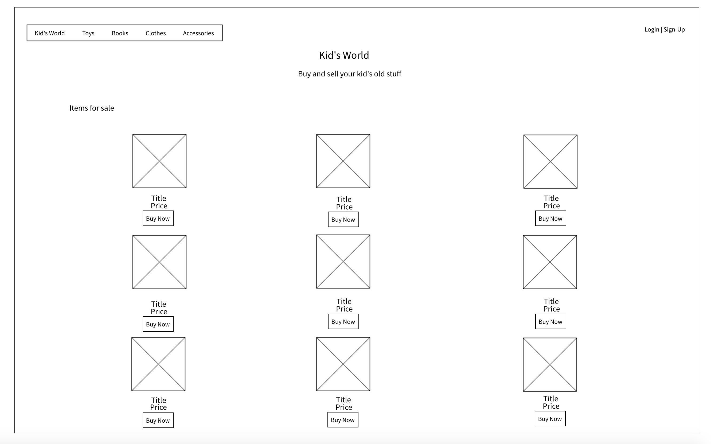
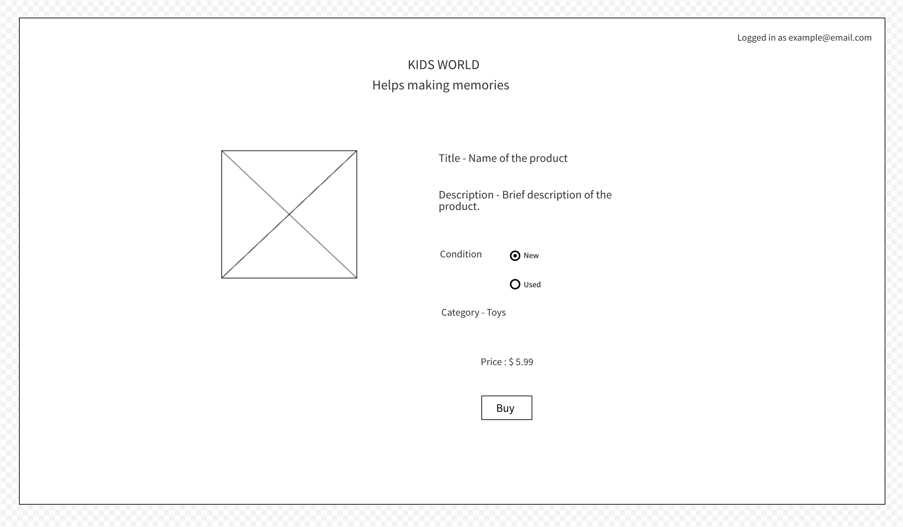

# Kid's World

- Deployed website - [kidsworld.heroku.com]( https://kidsworld.herokuapp.com/ )
- Github repository - [kidsworld github repository]( https://github.com/BlueCodeThree/KidsWorld )

A two-sided marketplace where people can buy and sell kids products, such as toys, clothes and more.

## Our Problem and Purpose

When it comes to babies and children, often they need many items that only get used for a short amount of time - they outgrow or lose interest in things quickly. Parents may rather pay a little bit less for second hand items, and also want to sell off items that are no longer being used. Our Kid's World application is a place where people can buy and sell their new or used children's items.

## Functionality and Features

The aim of our website is to buy and sell children's items. The main functionality when arriving at the website is the user is able to browse the items that are available for sale. In the top menu, a user can select a category to view. In a future implementation, the user will be able to sort the items by price or by condition (new, used etc), for example.

In a future implementation we also plan to add pagination to our all items and category pages, so that the user is not presented with all of the items on a single page. This will allow for faster loading times, and will mean that the user isn't overloaded with too much choice.

A user can purchase any of the items, but when they go to checkout the user must be logged in, in order to pay for the item. We decided that only one item can be purchased at a time, so that our users do not get confused as to the location/the seller of each item.

We decided that with the payment of the item, the postage would be included in the price or the buyer and seller could negotiate pickup/delivery. This is similar to how the website [gumtree](https://www.gumtree.com.au/), an Australian classified marketplace works.

Once a user has signed up or logged in, a user can be either (or both) a seller and a buyer. A user can add an item to be sold. A user can see another user's items for sale in their own sale page. A user can see all the items that have been sold, and all the items that they have purchased.

## Screenshots

## Tech stack (e.g. html, css, deployment platform, etc)

## Instructions on how to setup, configure and use your App.

- fork and clone
- bundle install
- update database.yml
- `rails db:schema:load`
- `rails db:seed`
- `rails s` to run the server

- Design documentation including,
- Design process
-

## User stories

We created a list of user stories that we needed to complete for our MVP, as well as user stories as stretch goals. They are as follows:

- A user can view all items available for sale

Sold items would not be viewable so that they do not confuse the buyer. A user would not have to be logged in to see all the items.

- A user can buy an item
- A user can sell an item (create a listing)

A user can only create a listing if they are signed in.

- A user can edit and delete a listing

A user would only be able to edit and delete their own listings.

- A user can upload an image to their listing
- A user can log in and out
- A user can view the details of an individual item
- A user can see a list of their past purchases (stretch goal)

Goal completed. A user can view their past purchases. We implemented a Purchases model to record who purchased what item.

- A user can see a list of their sold items (stretch goal)

Goal completed. A user can see their sold items, who purchased them, and the person's contact email

- A user can sort all the listings (by price, most recent, by category -- stretch goal)

We have implemented being able to select a category, as a part of our main menu. Sorting by most recent is the default view. In the future we would implement being able to sort by price, and other ways of sorting.

- A user can message another user (stretch goal)

We envision this will be so that users can contact other users through the website to organise pickup or delivery. At the moment, users get access to the person's email address which is not ideal.

- A user can post an item (stretch goal)

For this we would need to implement a new model that stores a user's address, as well as perhaps a postage model that has the different postage rates for items (this could possibly exist as a gem). In the item model we may need to include a place where a user inputs the weight of an item. There may also be a boolean for if the user wants to send and item or it to be pickup/delivery only (such as, if the item is too large to easily send). Postage would then have to be added to every order, and when the order is complete the seller would have access to the buyer's postage address.

### A workflow diagram of the user journey/s.
## Wireframes

### Mobile

### Desktop

### Tablet

- Database Entity Relationship Diagrams
- Details of planning process including,

### Project Planning and Timeline

#### Trello
Day 2 - July 23 Trello Board

Day 3 - July 24th Trello Board

## Short Answer Questions

- What is the need (i.e. challenge) that you will be addressing in your project?
- Identify the problem you’re trying to solve by building this particular marketplace App? Why is it a problem that needs solving?
- Describe the project will you be conducting and how. your App will address the needs.

Children outgrow clothes quickly, use toys for a small amount of time. Website allows parents to sell new and used kids items instead of throwing them out, and parents can buy quality products without having to pay retail.

- Describe the network infrastructure the App may be based on.
- Identify and describe the software to be used in your App.

### Identify the database to be used in your App and provide a justification for your choice

The database used in this app is postgresql. Postgres is an open source relational database.

When considering what database to use for this project, we ultimately chose postgres. One main advantage of using postgres is that it is natively supported with Heroku, our deployment platform.

In general, there are many advantages and disadvantages to using a postgres database. One advantage for us is the relational nature of the database, which helped with how we set up our ERD. This kind of database is good for transactional applications, another reason why it is a good fit for our project.

Being an open source database means that there would be many resources online to help us if we ran into any problems.

With the small nature of our app - only a few users and items to be implemented, with no real likelihood of needing to scale the app to a large amount of data - we did not have to fully explore the scalability of our database. That being said, one advantage of postgres is that it does scale to larger projects, however it can become more memory intensive for larger databases. If we were looking at needing a larger scale database in the future, this may have been more of a consideration. With our app as it is, postgres is fast and performant, as well as providing secure data storage.

Postgres does have a GUI interface if needed to be used as well as the command line interface, so it can be used by people with a wide range of technical knowledge.

With the only real disadvantage being that it can have slower performance on larger datasets, and with many advantages from compatibiliy with heroku and the relational style of database, made postgresql the perfect database for our application.

### Identify and describe the production database setup (i.e. postgres instance)
-
### Describe the architecture of your App.

- Explain the different high-level components (abstractions) in your App.

### Detail any third party services that your App will use.

Cloudinary - cloud storage for images
Stripe - moneys
Heroku - deployment

- Describe (in general terms) the data structure of marketplace apps that are similar to your own (e.g. eBay, Airbnb).

Data structure of Etsy?

- Discuss the database relations to be implemented.
- Describe your project’s models in terms of the relationships (active record associations) they have with each other.
- Provide your database schema design.
- Provide User stories for your App.
- Provide Wireframes for your App.
- Describe the way tasks are allocated and tracked in your project.

### Discuss how Agile methodology is being implemented in your project.

Although we were only a team of two, we implemented numerous agile methodologies in our workflow.

We broke down our user stories, and then integrated them into tasks on our trello kanban board (see the trello screenshot section).

We worked closely together, often utilizing pair programming, and we marked this time off on our trello boards as both working on the task. We also worked in daily sprints, utilising our trello board to track these sprints.

We participated in the classroom-wide stand up, which meant that we also together went through what we did the previous day, our goal for that day's sprint, and any obstacles that we were facing.

Our coding focused on feature driven development, aligning with our user stories, and we used [unit testing](https://github.com/BlueCodeThree/KidsWorld/blob/testing/log/test_results.log) to test our implementation.

We deployed early and often to Heroku, changing our requirements for the project if necessary.

- Provide an overview and description of your Source control process.

Github, feature branch, pull request.

### Provide an overview and description of your Testing process.

Rspec
to run, `rspec -f d`
Write a new feature, write a new test. Test driven development.
Save it to a log

Tests defined for all user stories **

- Discuss and analyse requirements related to information system security.
- Discuss methods you will use to protect information and data.
- Research what your legal obligations are in relation to handling user data.
-